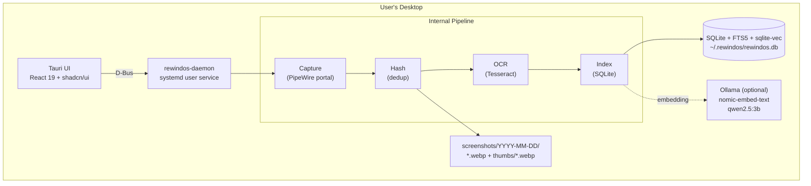
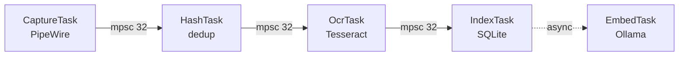

## Overview

RewindOS is a privacy-first, local-only screen capture and search tool for Linux/Wayland. The core flow is: **automated screen capture → OCR indexing → full-text search**, with optional **semantic search** and **AI chat** via Ollama.

All data stays in `~/.rewindos/`. No network requests except optional local Ollama (localhost:11434).

## System Architecture



<Info>
  The daemon runs as a systemd user service and communicates with the UI via D-Bus. All processing happens locally with no external network access (except optional Ollama).
</Info>

## Cargo Workspace Layout

RewindOS uses a Cargo workspace with three main crates:

```
rewindos/
├── Cargo.toml                  # Workspace root
├── crates/
│   ├── rewindos-core/          # Shared library
│   │   ├── migrations/
│   │   │   ├── V001__initial_schema.sql
│   │   │   └── V002__vector_embeddings.sql
│   │   └── src/
│   │       ├── lib.rs
│   │       ├── db.rs           # Database operations
│   │       ├── schema.rs       # Data models
│   │       ├── ocr.rs          # Tesseract wrapper
│   │       ├── hasher.rs       # Perceptual hashing
│   │       ├── config.rs       # Configuration
│   │       ├── embedding.rs    # Ollama embeddings
│   │       ├── chat.rs         # AI chat
│   │       └── error.rs        # Error types
│   │
│   └── rewindos-daemon/        # Capture daemon
│       └── src/
│           ├── main.rs         # Entry point, D-Bus server
│           ├── capture/        # PipeWire capture
│           ├── pipeline.rs     # Pipeline orchestration
│           ├── window_info/    # Window metadata
│           ├── service.rs      # D-Bus service
│           └── detect.rs       # Environment detection
│
├── src-tauri/                  # Tauri UI application
│   └── src/
│       └── lib.rs              # Tauri commands
│
└── src/                        # React frontend
    ├── components/
    └── lib/
```

## Component Details

### 1. rewindos-core (Shared Library)

The shared library that both the daemon and UI depend on.

**Responsibilities:**
- Database operations (CRUD, FTS5 search, vector search, hybrid search, scene dedup)
- Schema types / models (serde-serializable)
- Tesseract OCR wrapper (spawns `tesseract` CLI)
- Perceptual hashing (image-hasher crate)
- Configuration loading from `~/.rewindos/config.toml`
- OllamaClient for embeddings (health check, model management, embed)
- OllamaChatClient for AI chat (intent detection, streaming, context building)
- Database migrations (refinery)

**Key Dependencies:**
- `rusqlite` (with `bundled` + `fts5` features)
- `sqlite-vec` (vector similarity search extension)
- `image` + `image-hasher`
- `serde` + `serde_json` + `toml`
- `refinery` (migrations)
- `reqwest` (Ollama HTTP client)
- `chrono` (timestamps)
- `tokio` (async runtime)
- `tracing` (structured logging)

<Accordion title="Core Module Breakdown">
  <Tabs>
    <Tab title="db.rs">
      Database operations including:
      - SQLite connection management with WAL mode
      - Screenshot CRUD operations
      - FTS5 full-text search with snippet highlighting
      - Vector KNN search using sqlite-vec
      - Hybrid search with Reciprocal Rank Fusion (RRF)
      - Scene deduplication by perceptual hash
      - Activity analytics and app usage stats
      - Location: `crates/rewindos-core/src/db.rs`
    </Tab>
    <Tab title="schema.rs">
      Data models and types:
      - `Screenshot` - Full screenshot record
      - `NewScreenshot` - Insert DTO
      - `SearchResult` - Search result with snippet
      - `SearchResponse` - Paginated search results
      - `DaemonStatus` - Daemon state and metrics
      - `OcrStatus` - OCR processing state enum
      - Location: `crates/rewindos-core/src/schema.rs`
    </Tab>
    <Tab title="embedding.rs">
      Ollama integration for semantic search:
      - `OllamaClient::embed()` - Generate embeddings
      - `OllamaClient::health_check()` - Check availability
      - `OllamaClient::has_model()` - Verify model exists
      - `OllamaClient::pull_model()` - Download model
      - 30s timeout for requests, 10min for pulls
      - Location: `crates/rewindos-core/src/embedding.rs`
    </Tab>
  </Tabs>
</Accordion>

### 2. rewindos-daemon (Capture Service)

Long-running systemd user service that captures the screen.

**Responsibilities:**
- xdg-desktop-portal ScreenCast session management
- PipeWire stream → frame extraction
- Pipeline orchestration via tokio channels
- D-Bus server exposing control interface
- Active window metadata collection
- Ollama auto-detection and model pulling on startup
- Background embedding backfill
- Graceful shutdown on SIGTERM/SIGINT

**Pipeline Architecture:**



Each stage runs as an independent tokio task with bounded channels providing backpressure.

<Note>
  See [Capture Pipeline](/technical/capture-pipeline) for detailed stage-by-stage breakdown.
</Note>

**Daemon Startup Sequence:**
1. Load config, ensure directories
2. Check tesseract availability
3. Open database, run migrations
4. **Ollama auto-detection**: probe health → check model → pull if missing → enable semantic
5. Start capture pipeline
6. **Spawn background backfill** (if Ollama available): batch 50, 50ms delay between embeddings
7. Register D-Bus service
8. Start window info provider
9. Wait for shutdown signal

**Window Info Detection (fallback chain):**
1. `wlr-foreign-toplevel-management-v1` Wayland protocol (Hyprland, Sway, etc.)
2. `org.kde.KWin` D-Bus interface (KDE Plasma)
3. X11 `_NET_ACTIVE_WINDOW` via xcb (Xorg fallback)

### 3. Tauri UI (Search Application)

Desktop app for searching, browsing, chatting, and analytics.

**Frontend Stack:**
- React 19 + TypeScript
- shadcn/ui + Tailwind CSS
- TanStack Query (data caching)
- Tauri IPC (invoke Rust commands)

**Views:**
- **Search** — Full-text + semantic search with grid/list toggle, scene dedup badges
- **History** — Chronological screenshot browser with timeline scrubbing
- **Dashboard** — App usage analytics, daily/hourly activity charts
- **Ask** — AI chat with intent detection and screenshot references
- **Focus** — Pomodoro timer with productivity tracking and distraction detection
- **Settings** — Full configuration UI for all sections

## Search Architecture

### Three Search Modes

<Tabs>
  <Tab title="Keyword-only">
    When Ollama is not available:
    - FTS5 MATCH query
    - Scene deduplication
    - Pagination
    - Returns `search_mode: "keyword"`
  </Tab>
  <Tab title="Hybrid">
    When Ollama is available:
    - FTS5 keyword search (up to 300 results)
    - sqlite-vec KNN search (up to 300 results)
    - Reciprocal Rank Fusion (RRF, k=60)
    - Scene deduplication
    - Pagination
    - Returns `search_mode: "hybrid"`
  </Tab>
  <Tab title="Auto-detection">
    Search mode is automatically determined:
    - Daemon probes Ollama on startup
    - If available: pulls model if needed
    - Enables semantic transparently
    - UI receives mode in response
  </Tab>
</Tabs>

<Note>
  See [Search Architecture](/technical/search-architecture) for detailed implementation.
</Note>

### Scene Deduplication

Post-search grouping to collapse near-duplicate screenshots:

1. Over-fetch raw results (limit × 3, max 300)
2. Batch fetch perceptual hashes for all result IDs
3. Greedy grouping: iterate in rank order, assign each to first group where hamming distance ≤ 5
4. Representative (best-ranked) gets `group_count` and `group_screenshot_ids`
5. Paginate the deduped set

### Hybrid Search (Reciprocal Rank Fusion)

When Ollama is available:

```rust
// RRF score calculation (k=60)
for (rank, result) in fts_results.iter().enumerate() {
    score[result.id] += 1.0 / (60.0 + rank + 1.0);
}
for (rank, (id, _)) in vec_results.iter().enumerate() {
    score[id] += 1.0 / (60.0 + rank + 1.0);
}
```

## D-Bus Interface

**Bus Name:** `com.rewindos.Daemon`
**Object Path:** `/com/rewindos/Daemon`
**Interface:** `com.rewindos.Daemon`

**Methods:**
- `GetStatus()` → `DaemonStatus`
- `PauseCapture()`
- `ResumeCapture()`
- `TriggerCapture()`

## File System Layout

```
~/.rewindos/
├── config.toml                    # User configuration
├── rewindos.db                    # SQLite database (FTS5 + sqlite-vec)
├── screenshots/
│   └── YYYY-MM-DD/
│       ├── {timestamp_ms}.webp    # Full screenshots (~50-100KB each)
│       └── thumbs/
│           └── {timestamp_ms}.webp  # 320px wide thumbnails (~5-10KB)
└── logs/
    └── daemon.log
```

## Configuration (config.toml)

<Accordion title="Configuration Sections">
  ```toml
  [capture]
  interval_seconds = 5
  change_threshold = 3
  enabled = true

  [storage]
  base_dir = "~/.rewindos"
  retention_days = 90
  screenshot_quality = 80
  thumbnail_width = 320

  [privacy]
  excluded_apps = ["keepassxc", "1password", "bitwarden"]
  excluded_title_patterns = ["Private Browsing", "Incognito"]

  [ocr]
  enabled = true
  tesseract_lang = "eng"
  max_workers = 2

  [semantic]
  enabled = false           # Auto-enabled if Ollama detected
  ollama_url = "http://localhost:11434"
  model = "nomic-embed-text"
  embedding_dimensions = 768

  [chat]
  enabled = true
  ollama_url = "http://localhost:11434"
  model = "qwen2.5:3b"
  max_context_tokens = 4096
  temperature = 0.3

  [focus]
  work_minutes = 25
  short_break_minutes = 5
  daily_goal_minutes = 480
  distraction_apps = ["discord", "slack", "twitter"]
  ```
</Accordion>

## Error Handling Strategy

| Error | Recovery |
|-------|----------|
| PipeWire disconnects | Retry with exponential backoff (1s → 60s max) |
| Tesseract failures | Log and skip frame. Mark `ocr_status = 'failed'` |
| Disk full | Check available space before each write. Pause if < 1GB free |
| Ollama unavailable | Graceful degradation to keyword-only search |
| Embedding failures | Log and continue. Screenshot still searchable via FTS5 |
| Database corruption | rusqlite WAL mode for crash safety |

## Security Considerations

<Accordion title="Security Measures">
  - Database file permissions: 0600 (user-only read/write)
  - Screenshot directory: 0700
  - D-Bus interface only on session bus (user scope, not system)
  - Ollama connection is localhost-only (no external network)
  - Excluded apps list prevents capture of sensitive windows
</Accordion>

## Technical Stack Summary

<Tabs>
  <Tab title="Backend">
    - **Language**: Rust (stable)
    - **Database**: SQLite + FTS5 + sqlite-vec
    - **OCR**: Tesseract CLI
    - **Capture**: PipeWire + xdg-desktop-portal
    - **IPC**: D-Bus (zbus)
    - **Embeddings**: Ollama (nomic-embed-text)
    - **Chat**: Ollama (qwen2.5:3b)
  </Tab>
  <Tab title="Frontend">
    - **Framework**: React 19 + TypeScript
    - **UI**: shadcn/ui + Tailwind CSS
    - **Desktop**: Tauri v2
    - **Data**: TanStack Query
    - **Package Manager**: Bun
  </Tab>
  <Tab title="Platform">
    - **Target**: Linux (Wayland)
    - **Desktops**: KDE Plasma, GNOME, Hyprland, Sway
    - **Service**: systemd user service
    - **Dependencies**: libpipewire, tesseract, libdbus
  </Tab>
</Tabs>
