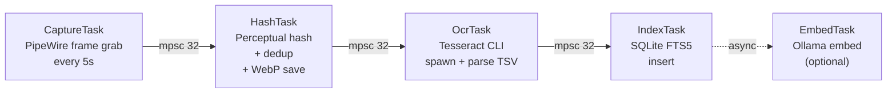
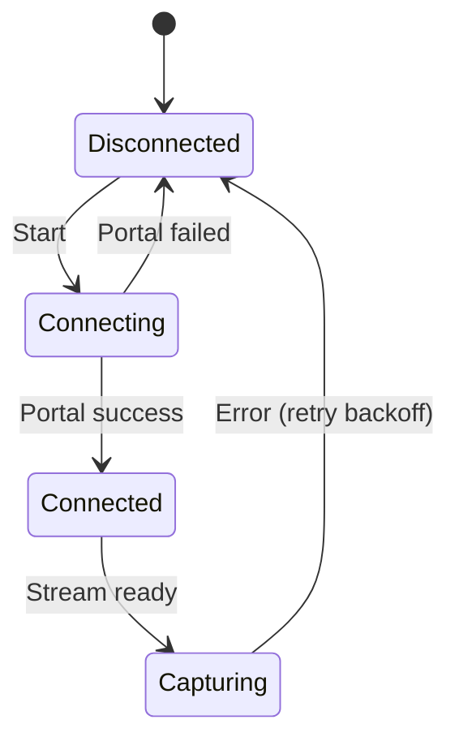
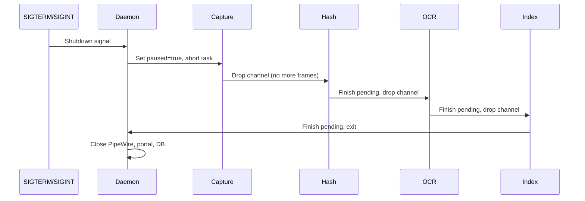

## Overview

The capture pipeline is the heart of the daemon. It runs as 5 async tasks connected by bounded tokio mpsc channels, forming a linear processing chain with backpressure. A separate background embedding task runs alongside when Ollama is available.

## Pipeline Stages



<Info>
  All channels have capacity 32, providing backpressure when downstream stages fall behind.
</Info>

## Data Types Flowing Through Channels

<Tabs>
  <Tab title="Capture → Hash">
    ```rust
    struct RawFrame {
        pixels: Vec<u8>,        // RGBA pixel data
        width: u32,
        height: u32,
        timestamp: i64,         // Unix timestamp (ms)
        app_name: Option<String>,
        window_title: Option<String>,
        window_class: Option<String>,
    }
    ```
  </Tab>
  <Tab title="Hash → OCR">
    ```rust
    struct ProcessedFrame {
        screenshot_id: i64,     // DB row ID
        file_path: PathBuf,     // Path to saved WebP
        thumbnail_path: PathBuf,
        timestamp: i64,
    }
    ```
  </Tab>
  <Tab title="OCR → Index">
    ```rust
    struct OcrResult {
        screenshot_id: i64,
        full_text: String,
        bounding_boxes: Vec<BoundingBox>,
    }

    struct BoundingBox {
        text: String,
        x: u32, y: u32,
        width: u32, height: u32,
        confidence: f32,
    }
    ```
  </Tab>
  <Tab title="Index → Embed">
    ```rust
    struct EmbedRequest {
        screenshot_id: i64,
        text: String,
    }
    ```
  </Tab>
</Tabs>

## Stage 1: CaptureTask

**Runs on:** tokio runtime (async)
**Input:** Timer ticks (configurable interval)
**Output:** `mpsc::Sender<RawFrame>` (capacity: 32)

### Behavior

```rust
loop {
    sleep(interval).await

    if paused { continue }

    // Check active window
    window_info = get_active_window().await
    if is_excluded(window_info) { continue }

    // Grab frame from PipeWire
    frame = pipewire_stream.capture_frame().await?

    raw_frame = RawFrame {
        pixels: frame.data,
        width: frame.width,
        height: frame.height,
        timestamp: now_ms(),
        app_name: window_info.app_name,
        window_title: window_info.title,
        window_class: window_info.class,
    }

    // Send to hash stage (blocks if channel full)
    capture_tx.send(raw_frame).await?
}
```

### PipeWire Connection Management



**Retry schedule:** 1s, 2s, 4s, 8s, 16s, 32s, 60s (max)

After 10 consecutive failures: log error, wait 5 minutes, retry

<Accordion title="Portal Session Setup (one-time)">
  ```rust
  async fn setup_portal_session(conn: &zbus::Connection) -> Result<u32> {
      let portal = ScreenCastProxy::new(conn).await?;

      // 1. Create session
      let session = portal.create_session(CreateSessionOptions {
          session_handle_token: "rewindos_session",
          ..Default::default()
      }).await?;

      // 2. Select sources (user picks monitor)
      portal.select_sources(&session, SelectSourcesOptions {
          types: SourceType::Monitor,
          multiple: false,
          ..Default::default()
      }).await?;

      // 3. Start — triggers permission dialog
      let response = portal.start(&session, StartOptions::default()).await?;

      // 4. Extract PipeWire node_id
      let streams = response.streams();
      let node_id = streams[0].pipe_wire_node_id();

      Ok(node_id)
  }
  ```
</Accordion>

**Location:** `crates/rewindos-daemon/src/pipeline.rs:167`

## Stage 2: HashTask

**Runs on:** tokio runtime (CPU-bound work via spawn_blocking)
**Input:** `mpsc::Receiver<RawFrame>` (capacity: 32)
**Output:** `mpsc::Sender<ProcessedFrame>` (capacity: 32)

### Behavior

```rust
let hasher = HasherConfig::new()
    .hash_size(8, 8)
    .hash_alg(HashAlg::Gradient)
    .to_hasher();

loop {
    raw_frame = hash_rx.recv().await?

    // Compute perceptual hash (CPU-bound)
    image = RgbaImage::from_raw(raw_frame.width, raw_frame.height, raw_frame.pixels)
    hash = spawn_blocking(|| hasher.hash_image(&image)).await?

    // Check against recent hashes
    recent_hashes = db.get_recent_hashes(raw_frame.timestamp - 30_000, 10).await?

    is_duplicate = recent_hashes.iter().any(|(_, prev_hash)| {
        hash.dist(prev_hash) <= config.change_threshold
    })

    if is_duplicate {
        metrics.frames_deduplicated += 1
        continue
    }

    // Save screenshot as WebP
    file_path = format_screenshot_path(raw_frame.timestamp)
    thumb_path = format_thumbnail_path(raw_frame.timestamp)

    spawn_blocking(|| {
        save_webp(&image, &file_path, config.screenshot_quality)?;
        let thumb = image.resize(320, u32::MAX, FilterType::Lanczos3);
        save_webp(&thumb, &thumb_path, 75)?;
    }).await?

    // Insert into DB
    screenshot_id = db.insert_screenshot(ScreenshotInsert {
        timestamp: raw_frame.timestamp,
        app_name: raw_frame.app_name,
        window_title: raw_frame.window_title,
        window_class: raw_frame.window_class,
        file_path: file_path.to_string(),
        thumbnail_path: thumb_path.to_string(),
        width: raw_frame.width,
        height: raw_frame.height,
        file_size_bytes: fs::metadata(&file_path)?.len(),
        perceptual_hash: hash.as_bytes().to_vec(),
    }).await?

    // Forward to OCR
    hash_tx.send(ProcessedFrame {
        screenshot_id,
        file_path,
        thumbnail_path: thumb_path,
        timestamp: raw_frame.timestamp,
    }).await?
}
```

### Deduplication Algorithm

Using **Gradient Hash** (dHash variant):

1. Resize image to 9×8 grayscale
2. Compare each pixel to its right neighbor
3. Produce 64-bit hash (8×8 = 64 comparisons)
4. Hamming distance between two hashes = number of differing bits

<Note>
  **Threshold interpretation:**
  - 0: Identical images
  - 1-3: Nearly identical (minor anti-aliasing, cursor moved)
  - 4-8: Similar (small text change, scroll position)
  - 9+: Different content
  
  **Default threshold: 3** (configurable in `config.toml`)
</Note>

**Location:** `crates/rewindos-daemon/src/pipeline.rs:194`

## Stage 3: OcrTask

**Runs on:** tokio runtime + subprocess spawning
**Input:** `mpsc::Receiver<ProcessedFrame>` (capacity: 32)
**Output:** `mpsc::Sender<OcrResult>` (capacity: 32)

### Behavior

```rust
let semaphore = Arc::new(Semaphore::new(config.ocr.max_workers)); // default: 2

loop {
    frame = ocr_rx.recv().await?

    let permit = semaphore.acquire().await?;

    // Spawn Tesseract CLI
    let output = Command::new("tesseract")
        .arg(&frame.file_path)
        .arg("stdout")
        .args(["--oem", "1"])      // LSTM OCR engine
        .args(["--psm", "3"])      // Fully automatic page segmentation
        .args(["-l", &config.ocr.tesseract_lang])
        .arg("tsv")               // TSV output with bounding boxes
        .output()
        .await?;

    drop(permit);

    if !output.status.success() {
        db.update_ocr_status(frame.screenshot_id, "failed").await?;
        continue;
    }

    // Parse TSV output
    let (full_text, boxes) = parse_tesseract_tsv(&output.stdout)?;

    if full_text.trim().is_empty() {
        db.update_ocr_status(frame.screenshot_id, "done").await?;
        continue;
    }

    ocr_tx.send(OcrResult {
        screenshot_id: frame.screenshot_id,
        full_text,
        bounding_boxes: boxes,
    }).await?
}
```

### Tesseract TSV Output Format

```
level  page_num  block_num  par_num  line_num  word_num  left  top  width  height  conf  text
5      1         1          1        1         1         100   50   80     20      96    Hello
5      1         1          1        1         2         190   50   90     20      94    World
```

<Accordion title="Parsing Rules">
  - **Level 5** = individual words (what we care about)
  - **Confidence < 30%** → skip
  - Group words by `line_num` for full text reconstruction
  - Store individual word bounding boxes for future click-to-copy
</Accordion>

**Location:** `crates/rewindos-daemon/src/pipeline.rs` + `crates/rewindos-core/src/ocr.rs`

## Stage 4: IndexTask

**Runs on:** dedicated thread (via `spawn_blocking`) — rusqlite is synchronous
**Input:** `mpsc::Receiver<OcrResult>` (capacity: 32)
**Output:** (terminal stage, writes to SQLite)

### Behavior

```rust
loop {
    ocr_result = index_rx.blocking_recv()?

    // Insert OCR text (triggers FTS5 sync via SQLite trigger)
    db.insert_ocr_text(
        ocr_result.screenshot_id,
        &ocr_result.full_text,
    )?;

    // Insert bounding boxes
    db.insert_bounding_boxes(
        ocr_result.screenshot_id,
        &ocr_result.bounding_boxes,
    )?;

    // Update screenshot status
    db.update_ocr_status(ocr_result.screenshot_id, "done")?;

    metrics.frames_indexed += 1;

    // Periodic FTS5 optimization
    if metrics.frames_indexed % 1000 == 0 {
        db.optimize_fts()?;
    }
}
```

<Note>
  The FTS5 index is automatically updated via a trigger when inserting into `ocr_text_content`, keeping both tables in sync.
</Note>

**Location:** `crates/rewindos-daemon/src/pipeline.rs`

## Stage 5: EmbedTask (Optional)

**Runs on:** tokio task (async, spawned after pipeline start)
**Input:** `mpsc::Receiver<EmbedRequest>` (from IndexTask)
**Output:** Writes to `ocr_embeddings` (sqlite-vec) table
**Prerequisite:** Ollama detected and reachable on daemon startup

### Behavior

```rust
loop {
    request = embed_rx.recv().await?

    // Generate embedding via Ollama
    embedding = ollama_client.embed(&request.text).await?
    
    if embedding.is_none() {
        // Ollama went away, stop gracefully
        break;
    }

    // Store in sqlite-vec
    db.insert_embedding(request.screenshot_id, &embedding.unwrap())?;
    
    sleep(50ms) // Rate limiting
}
```

**Location:** `crates/rewindos-daemon/src/pipeline.rs`

## Background Embedding Backfill

Spawned once on daemon startup if Ollama is available:

```rust
loop {
    pending = db.get_pending_embeddings(batch_size=50)
    if pending.is_empty() { break }  // All caught up

    for (screenshot_id, text) in pending {
        embedding = ollama_client.embed(text).await
        if embedding.is_none() { return }  // Ollama went away
        db.insert_embedding(screenshot_id, embedding)
        sleep(50ms)  // Don't overwhelm Ollama
    }
}
log("backfill complete, processed N screenshots")
```

<Accordion title="Key Details">
  - **Batch size**: 50 screenshots per DB query
  - **Rate limiting**: 50ms delay between individual embeddings
  - **Graceful degradation**: If Ollama becomes unavailable mid-backfill, stops silently
  - **Idempotent**: Only processes `embedding_status = 'pending'` rows
  - **Non-blocking**: Runs independently of the capture pipeline
  - **CLI alternative**: `cargo run -p rewindos-daemon -- backfill --batch-size 50`
</Accordion>

## Shutdown Sequence



**Timeout:** If any stage doesn't finish within 30s, force exit.

## Metrics (exposed via D-Bus GetStatus)

| Metric | Type | Description |
|--------|------|-------------|
| `frames_captured_today` | u64 | Total frames grabbed from PipeWire |
| `frames_deduplicated_today` | u64 | Frames skipped (hash match) |
| `frames_ocr_pending` | u64 | Current OCR queue depth |
| `frames_indexed_today` | u64 | Frames with OCR text written to DB |
| `capture_queue_depth` | u64 | Items in capture→hash channel |
| `hash_queue_depth` | u64 | Items in hash→ocr channel |
| `ocr_queue_depth` | u64 | Items in ocr→index channel |

## Error Recovery

<Tabs>
  <Tab title="PipeWire">
    **Error:** PipeWire disconnect
    
    **Recovery:** Exponential backoff retry (1s → 60s max)
    
    **Behavior:** Continues retrying indefinitely, logs warnings
  </Tab>
  <Tab title="Tesseract">
    **Error:** Tesseract crash or timeout (>10s)
    
    **Recovery:** Log, mark screenshot as `ocr_status='failed'`, continue
    
    **Behavior:** Screenshot saved but not searchable
  </Tab>
  <Tab title="SQLite">
    **Error:** SQLite busy
    
    **Recovery:** WAL mode + 5s `busy_timeout` handles this automatically
    
    **Behavior:** Write waits, then succeeds or errors
  </Tab>
  <Tab title="Disk Full">
    **Error:** Disk space < 1GB
    
    **Recovery:** Pause capture, emit D-Bus signal, retry every 60s
    
    **Behavior:** Daemon stays alive, resumes when space available
  </Tab>
  <Tab title="Channel Full">
    **Error:** Channel capacity reached (32 items)
    
    **Recovery:** Sender blocks until consumer catches up (backpressure)
    
    **Behavior:** Natural flow control, no data loss
  </Tab>
</Tabs>

## Performance Characteristics

<Accordion title="Typical Metrics (5s interval)">
  - **Capture**: 200ms per frame (PipeWire grab)
  - **Hash**: 50ms (perceptual hash + WebP save)
  - **OCR**: 500-1500ms (Tesseract, varies by content)
  - **Index**: 10ms (SQLite insert)
  - **Embed**: 100-300ms (Ollama, local)
  
  **Throughput:** ~12 screenshots/minute (assuming 5s interval)
  **Daily storage:** ~150-300MB (90% deduped, quality 80)
</Accordion>
